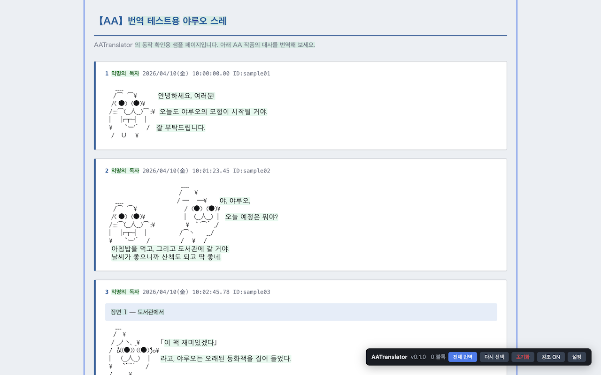
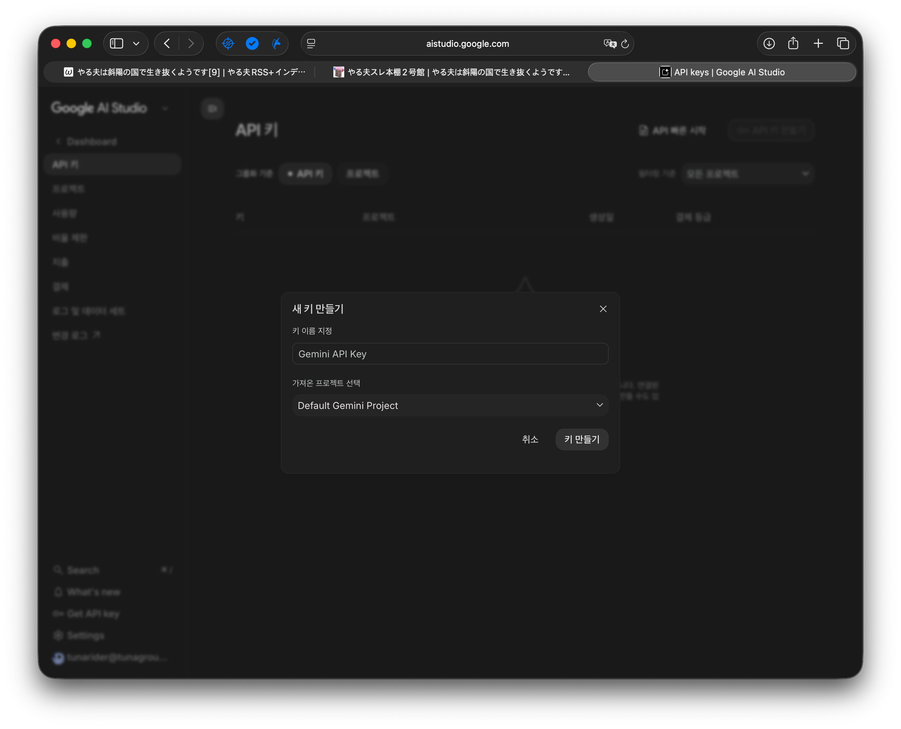
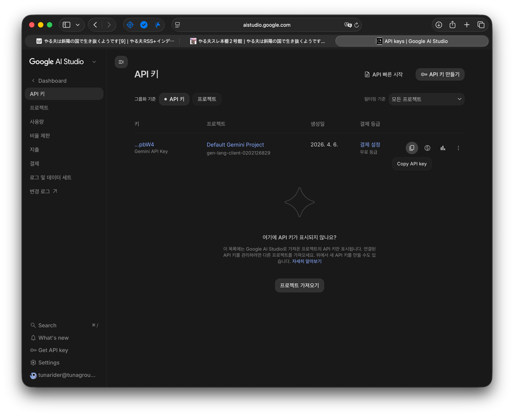

# AATranslator

Translate Japanese AA (Ascii Art / Yaruo-style) works in-place on any web page using LLMs. Only the meaningful Japanese text is replaced — the ASCII art is preserved exactly as drawn.

> 브라우저에서 일본어 AA(아스키 아트 / 야루오계) 작품을 LLM으로 그 자리에서 번역합니다. ASCII 아트는 그대로 두고 의미 있는 일본어만 번역돼요.



---

## Table of Contents

- [English](#english)
  - [Features](#features)
  - [How It Works](#how-it-works)
  - [Installation](#installation)
  - [Configuration](#configuration)
  - [Getting a Gemini API key](#getting-a-gemini-api-key)
  - [Usage](#usage)
  - [Supported Providers](#supported-providers)
  - [Development](#development)
  - [Project Structure](#project-structure)
  - [Privacy](#privacy)
- [한국어](#한국어)
  - [주요 기능](#주요-기능)
  - [동작 방식](#동작-방식)
  - [설치](#설치)
  - [설정](#설정)
  - [Gemini API 키 발급](#gemini-api-키-발급)
  - [사용법](#사용법)
  - [지원 Provider](#지원-provider)
  - [개발](#개발)
  - [프로젝트 구조](#프로젝트-구조)
  - [개인정보](#개인정보)

---

## English

### Features

- **Block-based translation** — detects Japanese text blocks (hiragana / katakana / kanji, 2+ chars) while leaving ASCII art untouched
- **Click to translate** — click any highlighted block to translate a single phrase; click again to toggle between original and translation
- **Translate all** — batch-translate every block in a selected container with configurable concurrency
- **Manual selection** — drag-select arbitrary text and click the "Translate" popup
- **4 LLM providers** — OpenAI, Google Gemini, Anthropic Claude, Ollama (local)
- **Rate limiting & retries** — per-provider RPM gate (Gemini free-tier friendly) plus 5-attempt exponential backoff on 429 / 503 / 529
- **i18n UI** — toolbar and settings available in Korean, English, and Japanese (follows Chrome's language)
- **Highlight customization** — 6 color presets for translated blocks, or transparent
- **No telemetry** — settings live in `chrome.storage.sync`; only your translated text is sent to the LLM you configured

### How It Works

1. A content script wraps Japanese tokens (detected by Unicode range) in `<span class="aat-block">` elements.
2. The background service worker proxies LLM calls so API keys never touch page scripts.
3. The LLM is asked to classify each block as *meaningful* vs *decorative* and return a translation for meaningful ones. Decorative fragments (kanji shading, etc.) are left alone.
4. Translations are applied in place, preserving line breaks. You can toggle back to the original with a click.

**Batching.** "Translate All" does not send one request per block — blocks are packed into batches by character count (3,000 chars for OpenAI / Gemini / Claude, 1,000 for Ollama) and sent as a single numbered-fragments request. The LLM replies with a JSON array keyed by fragment index. If a batch fails to parse or an index is missing, the affected spans fall back to a smaller batch, and finally to individual per-block calls. Batches run in parallel up to the configured concurrency.

### Installation

Not yet on the Chrome Web Store. Two ways to install:

**Option A — Download a release (recommended)**

1. Go to the [Releases page](https://github.com/tunaground/AATranslator/releases) and download the latest `aatranslator-<version>.zip`.
2. Unzip it somewhere you'll keep it (e.g. `~/Applications/aatranslator-<version>/`). Chrome will refer to this folder every time the extension loads, so don't delete it.
3. Open `chrome://extensions/`, enable **Developer mode** (top right), click **Load unpacked**, and select the unzipped folder.
4. Click the AATranslator icon in the browser toolbar to open the floating in-page toolbar.

**Option B — Load from source**

1. Clone this repo.
2. Open `chrome://extensions/`, enable **Developer mode**, click **Load unpacked**, and select the cloned directory.
3. Click the AATranslator icon to open the toolbar.

Want to build the zip yourself? Run `npm run package` — it writes `dist/aatranslator-<version>.zip`.

### Configuration

Click the **Settings** button on the floating toolbar. All values are stored in `chrome.storage.sync`.

| Field | Default | Notes |
|---|---|---|
| Provider | `Google Gemini` | OpenAI / Gemini / Claude / Ollama |
| Model | `gemini-2.5-flash-lite` | Any model name the provider accepts |
| API Key | *(empty)* | Not required for Ollama |
| Concurrency | `3` | Parallel in-flight batches (1 / 2 / 3 / 5 / 8 / 10) |
| Target Language | `한국어` | Translation output language (Korean / English / Japanese) |
| Highlight Color | Light green | 5 color presets + transparent |

### Getting a Gemini API key

The default provider is Google Gemini, and `gemini-2.5-flash-lite` ships with a generous free-tier quota. AATranslator automatically throttles requests to stay under the free-tier rate limit, so you don't have to manage concurrency yourself.

1. Open [Google AI Studio → API keys](https://aistudio.google.com/apikey) and sign in with your Google account.
2. Click **API 키 만들기 / Create API key** (top right). Give the key a name and leave the default Gemini project selected, then click **키 만들기 / Create key**.

   

3. The new key appears in the list. Hover over the row and click the **Copy API key** icon.

   

4. Open AATranslator's **Settings** from the floating toolbar. Confirm Provider is `Google Gemini` and Model is `gemini-2.5-flash-lite`, paste the copied key into **API Key**, and click **저장 / Save**. The warning indicator on the Settings button should disappear once both Model and API Key are filled in.

### Usage

1. Click the extension icon — the thin toolbar appears at the bottom-right.
2. Click **Select** and then click a container (e.g. a `<p>` or `<div>`) that holds AA + text.
3. Japanese blocks inside the container get highlighted.
4. Click **Translate All** to batch-translate everything, or click individual blocks.
5. Click any translated block to toggle original / translation.
6. Drag-select arbitrary text on the page and click the **Translate** popup to translate a custom range.

Extra controls:

- **HL ON/OFF** — toggle the translation highlight color
- **Reselect** — pick a different container
- **Reset** — unwrap all spans and start over
- **Cancel** — stop a running "Translate All"

### Supported Providers

| Provider | Host | Notes |
|---|---|---|
| OpenAI | `api.openai.com` | Chat Completions API, `max_tokens: 8192` |
| Google Gemini | `generativelanguage.googleapis.com` | `generateContent`, `maxOutputTokens: 8192` |
| Anthropic Claude | `api.anthropic.com` | Messages API, `anthropic-version: 2023-06-01` |
| Ollama | `http://localhost:11434` | Local only; no API key needed |

The background worker enforces a minimum **~4.5s interval** between Gemini calls (~13 RPM) to stay safely under the free-tier 15 RPM cap, so you don't need to manage concurrency yourself. Other providers are unthrottled. On top of that, any `429 / 503 / 529` response triggers up to **5 retries** with exponential backoff (max 60s per wait, ~30s cumulative for transient errors).

### Development

Requires Node 18+ (uses the built-in test runner). Zero npm dependencies.

```bash
# Run the unit tests (pure core modules only)
npm test
```

Current test coverage: **52 tests** across `ja-blocks`, `batches`, `prompts`, `parse`, and `providers`.

The content layer (`src/content/*.js`) is intentionally not unit-tested — it's thin glue and is verified manually by loading the unpacked extension.

### Project Structure

```
AATranslator/
├── manifest.json              # Chrome MV3 manifest
├── package.json               # ES modules, "node --test" script
├── icons/                     # 48px / 128px extension icons
├── _locales/{ko,en,ja}/       # i18n message bundles
├── src/
│   ├── background.js          # Service worker — LLM proxy with retry
│   ├── core/                  # Pure, unit-tested modules
│   │   ├── ja-blocks.js       #   Japanese token detection
│   │   ├── batches.js         #   Char-count packing
│   │   ├── prompts.js         #   LLM prompt builders
│   │   ├── parse.js           #   Response parsers (JSON + fences)
│   │   └── providers.js       #   Per-provider request/response adapters
│   └── content/               # DOM + Chrome glue
│       ├── bootstrap.js       #   Dynamic import loader
│       ├── main.js            #   Entry point
│       ├── state.js           #   Shared state + settings loader
│       ├── i18n.js            #   t() helper around chrome.i18n
│       ├── llm.js             #   sendMessage bridge to background
│       ├── dom.js             #   Wrap/unwrap, highlight helpers
│       ├── translate-flow.js  #   Orchestrates core + DOM
│       ├── selection.js       #   Container + manual selection
│       ├── ui.js              #   Toolbar + settings modal
│       └── styles.css
├── tests/                     # Node --test suites for core/
└── docs/superpowers/          # Design spec + implementation plan
```

### Privacy

See [PRIVACY.md](PRIVACY.md). In short: nothing leaves your browser except the text you explicitly translate, and it only goes to the LLM provider you chose.

Version history is tracked in [CHANGELOG.md](CHANGELOG.md).

---

## 한국어

### 주요 기능

- **블록 단위 번역** — 히라가나 / 가타카나 / 한자 2글자 이상인 일본어 블록만 감지해서 번역하고, ASCII 아트는 그대로 둬요
- **클릭 번역** — 강조된 블록을 클릭하면 한 문장만 번역하고, 다시 누르면 원문/번역 토글
- **전체 번역** — 선택한 영역 안의 모든 블록을 동시성 설정대로 배치 번역
- **수동 선택** — 마우스로 드래그한 범위를 "번역" 팝업으로 번역
- **4개 LLM provider** — OpenAI, Google Gemini, Anthropic Claude, Ollama (로컬)
- **레이트 리밋 & 재시도** — provider별 RPM 게이트 (Gemini 무료 티어 호환) + 429 / 503 / 529에 대해 5회 지수 백오프
- **UI 다국어** — 툴바·설정이 한국어·영어·일본어 (크롬 언어에 따라 자동)
- **강조 색상 커스터마이즈** — 5가지 프리셋 + 투명
- **텔레메트리 없음** — 설정은 `chrome.storage.sync`에만 저장, 직접 번역한 텍스트만 설정한 LLM으로 전송

### 동작 방식

1. 콘텐츠 스크립트가 유니코드 범위로 일본어 토큰을 찾아 `<span class="aat-block">`로 감싸요.
2. 백그라운드 서비스 워커가 LLM 호출을 대신 해서 API 키가 페이지 스크립트에 노출되지 않아요.
3. 각 블록이 *의미 있는 문장*인지 *장식*인지 LLM이 판단하고, 의미 있는 것만 번역본을 돌려줘요. 장식용 한자 음영 등은 그대로 냅둬요.
4. 번역 결과를 줄바꿈 유지하면서 제자리에 적용. 클릭 한 번이면 원문으로 되돌릴 수 있어요.

**배치 요청.** "전체 번역"은 블록마다 개별 요청을 보내지 않아요 — 블록들을 **문자 수 기준**으로 묶어서 (OpenAI / Gemini / Claude는 3,000자, Ollama는 1,000자) 하나의 번호 매긴 요청으로 전송해요. LLM은 인덱스별 JSON 배열로 답하고, 응답이 파싱 안 되거나 인덱스가 빠지면 해당 블록들만 더 작은 배치 → 최종적으로 개별 호출로 fallback. 배치들은 설정된 동시 실행 수만큼 병렬로 돌아가요.

### 설치

아직 Chrome Web Store 배포 전이라 두 가지 방법 중 골라주세요:

**방법 A — 릴리스 zip 다운로드 (권장)**

1. [Releases 페이지](https://github.com/tunaground/AATranslator/releases)에서 최신 `aatranslator-<version>.zip`을 받으세요.
2. 계속 보관할 경로(예: `~/Applications/aatranslator-<version>/`)에 압축을 풀어주세요. Chrome이 매번 이 폴더를 참조하니까 지우면 안 돼요.
3. `chrome://extensions/` 열기 → 우상단 **개발자 모드** 켜기 → **압축해제된 확장 프로그램을 로드합니다** 클릭 → 압축 푼 폴더 선택.
4. 브라우저 툴바의 AATranslator 아이콘 클릭하면 페이지 우측 하단에 플로팅 툴바가 떠요.

**방법 B — 소스에서 로드**

1. 이 저장소를 clone.
2. `chrome://extensions/` → **개발자 모드** → **압축해제된 확장 프로그램을 로드합니다** → clone한 폴더 선택.
3. 확장 아이콘 클릭해서 툴바 열기.

직접 zip을 빌드하고 싶다면: `npm run package` 실행하면 `dist/aatranslator-<version>.zip`이 생성돼요.

### 설정

툴바의 **설정** 버튼을 눌러서 변경할 수 있어요. 모든 값은 `chrome.storage.sync`에 저장돼요.

| 항목 | 기본값 | 비고 |
|---|---|---|
| Provider | `Google Gemini` | OpenAI / Gemini / Claude / Ollama |
| Model | `gemini-2.5-flash-lite` | provider가 허용하는 모델명 |
| API Key | *(비어있음)* | Ollama는 불필요 |
| 동시 실행 수 | `3` | 병렬 배치 수 (1 / 2 / 3 / 5 / 8 / 10) |
| 번역 대상 언어 | `한국어` | 번역 결과 언어 (한국어 / 영어 / 일본어) |
| 강조 색상 | 연녹색 | 5가지 프리셋 + 투명 |

### Gemini API 키 발급

기본 provider는 Google Gemini고, `gemini-2.5-flash-lite`는 무료 플랜에 넉넉한 쿼터가 포함돼 있어요. AATranslator가 무료 플랜 rate limit 아래로 자동 조절해주니 동시성을 직접 관리할 필요 없어요.

1. [Google AI Studio → API 키](https://aistudio.google.com/apikey)를 열고 구글 계정으로 로그인하세요.
2. 우상단 **API 키 만들기** 클릭. 키 이름을 지정하고 Default Gemini Project를 그대로 둔 다음 **키 만들기** 클릭.

   

3. 목록에 새 키가 추가돼요. 행에 마우스를 올리면 나타나는 **Copy API key** 아이콘을 클릭해 복사하세요.

   

4. 페이지 우하단 AATranslator 툴바의 **설정** 버튼을 열어서 Provider가 `Google Gemini`, Model이 `gemini-2.5-flash-lite`인지 확인하고, **API Key** 칸에 복사한 키를 붙여넣은 뒤 **저장**. Model과 API Key가 모두 채워지면 설정 버튼의 ⚠ 경고 표시가 사라져요.

### 사용법

1. 확장 아이콘 클릭 → 우측 하단에 얇은 툴바가 나타나요.
2. **영역 선택** → AA + 텍스트가 있는 요소(예: `<p>`, `<div>`) 클릭.
3. 영역 안의 일본어 블록이 자동으로 강조돼요.
4. **전체 번역**으로 일괄 번역하거나, 블록 하나씩 클릭해서 번역.
5. 번역된 블록을 클릭하면 원문/번역 토글.
6. 페이지 임의 텍스트를 드래그 선택하고 뜨는 **번역** 팝업을 클릭하면 해당 범위만 번역.

추가 버튼:

- **강조 ON/OFF** — 번역 블록 강조 색 토글
- **다시 선택** — 다른 영역 선택
- **초기화** — 래핑 해제하고 처음 상태로
- **취소** — 진행 중인 전체 번역 중단

### 지원 Provider

| Provider | 호스트 | 비고 |
|---|---|---|
| OpenAI | `api.openai.com` | Chat Completions API, `max_tokens: 8192` |
| Google Gemini | `generativelanguage.googleapis.com` | `generateContent`, `maxOutputTokens: 8192` |
| Anthropic Claude | `api.anthropic.com` | Messages API, `anthropic-version: 2023-06-01` |
| Ollama | `http://localhost:11434` | 로컬 전용; API 키 불필요 |

백그라운드 워커는 Gemini 호출 사이에 최소 **~4.5초 간격**(~13 RPM)을 유지해서 무료 티어 15 RPM 한도를 안전하게 지켜요. 동시성은 사용자가 직접 제어하지 않아도 돼요. 다른 provider는 제한 없음. 그 위에 `429 / 503 / 529` 응답이 오면 **최대 5회** 지수 백오프 재시도 (단일 대기 최대 60초, 일시적 에러에는 누적 ~30초 수준).

### 개발

Node 18+ 필요 (내장 테스트 러너 사용). npm 의존성 0개.

```bash
# 순수 core 모듈 단위 테스트 실행
npm test
```

현재 커버리지: `ja-blocks`, `batches`, `prompts`, `parse`, `providers` 5개 모듈에 걸쳐 **52개 테스트**.

콘텐츠 레이어(`src/content/*.js`)는 의도적으로 단위 테스트하지 않아요 — 얇은 글루 코드이고, unpacked 로 로드해서 수동 검증해요.

### 프로젝트 구조

```
AATranslator/
├── manifest.json              # Chrome MV3 manifest
├── package.json               # ES modules, "node --test" 스크립트
├── icons/                     # 48px / 128px 확장 아이콘
├── _locales/{ko,en,ja}/       # i18n 메시지 번들
├── src/
│   ├── background.js          # 서비스 워커 — 재시도 포함 LLM 프록시
│   ├── core/                  # 순수, 단위 테스트되는 모듈
│   │   ├── ja-blocks.js       #   일본어 토큰 감지
│   │   ├── batches.js         #   문자 수 기반 배치 패킹
│   │   ├── prompts.js         #   LLM 프롬프트 빌더
│   │   ├── parse.js           #   응답 파서 (JSON + 코드 펜스)
│   │   └── providers.js       #   provider별 요청/응답 어댑터
│   └── content/               # DOM + Chrome 글루
│       ├── bootstrap.js       #   동적 import 로더
│       ├── main.js            #   엔트리
│       ├── state.js           #   공유 상태 + 설정 로더
│       ├── i18n.js            #   chrome.i18n 래퍼 t()
│       ├── llm.js             #   백그라운드 sendMessage 브릿지
│       ├── dom.js             #   wrap/unwrap, 강조 헬퍼
│       ├── translate-flow.js  #   core + DOM 오케스트레이션
│       ├── selection.js       #   컨테이너 + 수동 텍스트 선택
│       ├── ui.js              #   툴바 + 설정 모달
│       └── styles.css
├── tests/                     # core/ 모듈 대상 node --test 스위트
└── docs/superpowers/          # 디자인 스펙 + 구현 플랜
```

### 개인정보

[PRIVACY.md](PRIVACY.md) 참조. 요약: 직접 번역한 텍스트 외에는 브라우저 밖으로 아무것도 나가지 않고, 그 텍스트도 본인이 설정한 LLM provider에게만 전송돼요.

버전별 변경 내역은 [CHANGELOG.md](CHANGELOG.md)에서 확인할 수 있어요.
